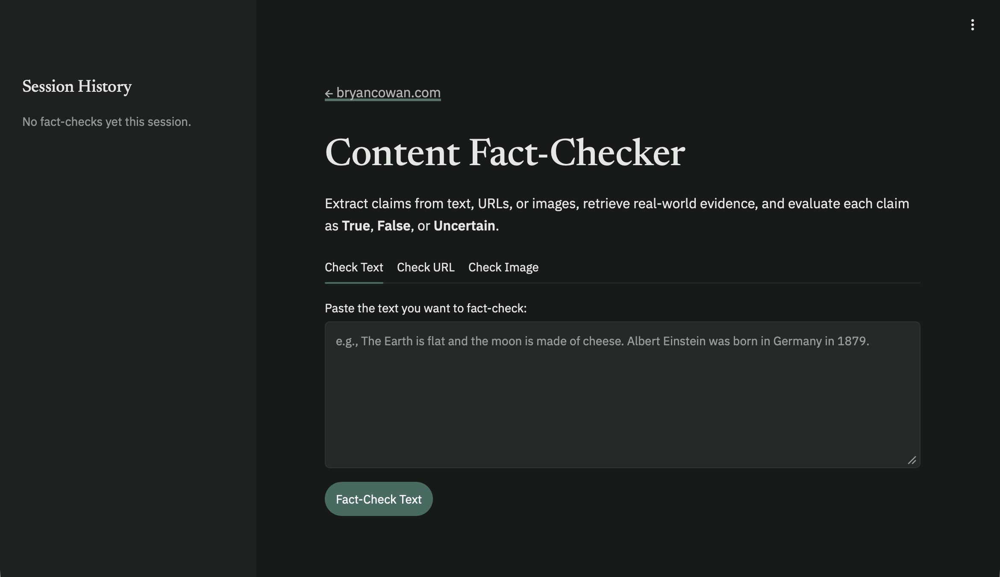
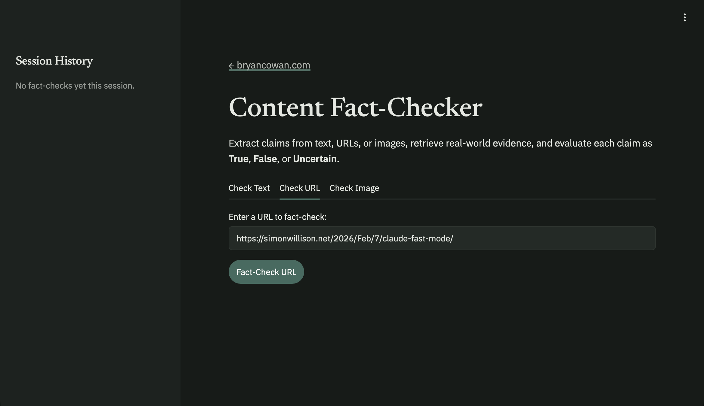
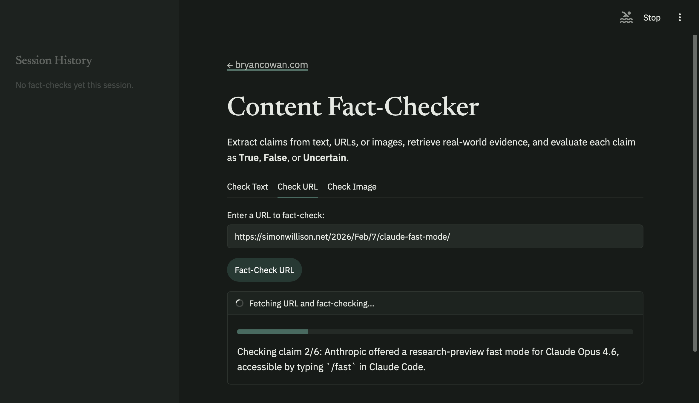
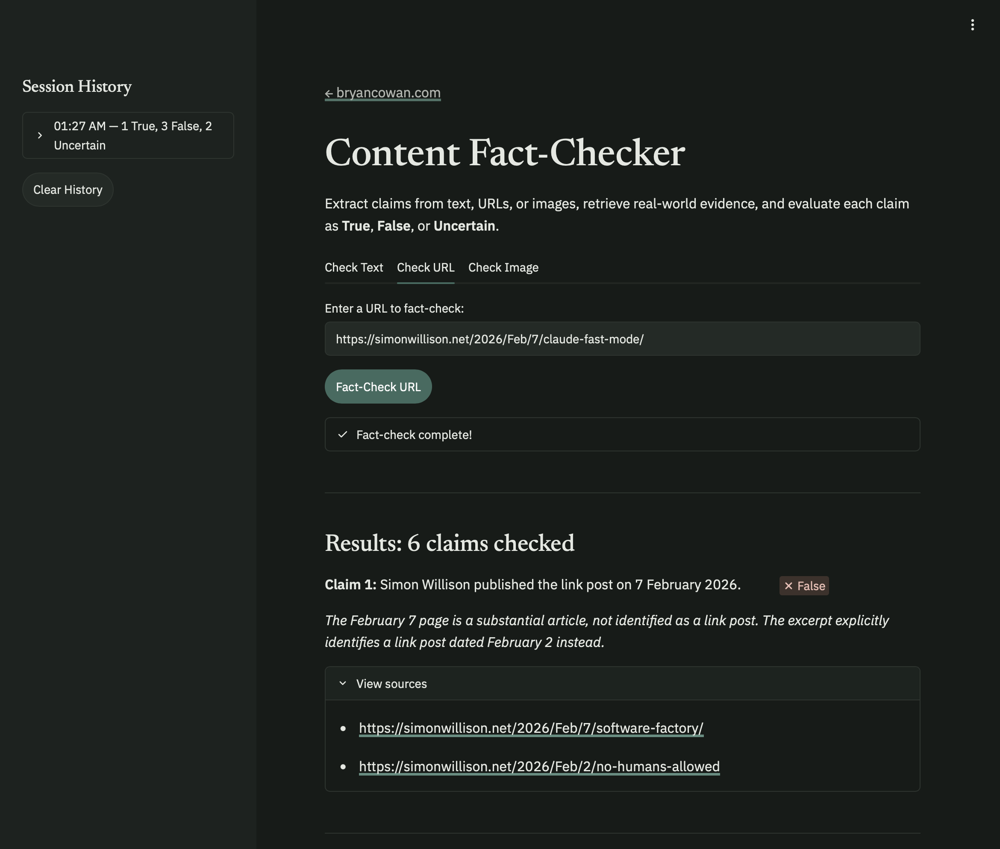

# Content Fact-Checker

Extracts claims from any text, URL, or image, retrieves real-world evidence using web search, and evaluates each claim as **True**, **False**, or **Uncertain**.

Powered by OpenAI's [gpt-6-luna](https://developers.openai.com/api/docs/models/gpt-6-luna) and [Parallel Search](https://parallel.ai/). [Cerebras](https://cerebras.ai/) (`qwen-3.8-27b`) is supported as an alternate provider; see [Changing the Provider or Model](#changing-the-provider-or-model).

Based on the [OpenAI Cookbook: Build Your Own Content Fact-Checker](https://cookbook.openai.com/articles/gpt-oss/build-your-own-fact-checker-cerebras), adapted to use gpt-6-luna (or qwen-3.8-27b on Cerebras) instead of gpt-oss-120B.

## How It Works

1. **Extract claims** — The LLM breaks input text, a fetched URL's article body, or an uploaded image into atomic, checkable factual statements
2. **Search for evidence** — Each claim is searched against the web using Parallel Search
3. **Judge each claim** — The LLM evaluates evidence and returns a verdict: True, False, or Uncertain, with reasoning and source URLs

### Screenshots

**Check Text tab** — paste any text to fact-check:



**Check URL tab** — enter a URL to analyze:



**Check Image tab** — upload a screenshot, chart, or infographic to analyze:

**Progress** — each claim is checked in real time:



**Results** — verdicts with reasoning and source links:



## Setup

### Prerequisites

- Python 3.13 (tested/deployed version; 3.10+ should also work)
- An [OpenAI API key](https://platform.openai.com/api-keys), or a [Cerebras API key](https://cloud.cerebras.ai/) (free tier available) if you set `LLM_PROVIDER=cerebras`
- A [Parallel API key](https://platform.parallel.ai/) (free tier available)

### Installation

```bash
git clone https://github.com/bryancowan/content-fact-checker.git
cd content-fact-checker
python3 -m venv .venv
source .venv/bin/activate
pip install -r requirements.txt
```

### Configure API Keys

```bash
cp .env.example .env
```

Edit `.env` and add your keys:

```
OPENAI_API_KEY=your_openai_key_here
PARALLEL_API_KEY=your_parallel_key_here
```

To use Cerebras instead, set `LLM_PROVIDER=cerebras` and provide `CEREBRAS_API_KEY`.

## Usage

Activate the virtual environment first:

```bash
source .venv/bin/activate
```

### Web Interface

```bash
streamlit run web_app.py --server.headless true
```

Then open **http://127.0.0.1:8501** in your browser.

> **Safari users:** If you get an HTTPS error with `localhost`, use `http://127.0.0.1:8501` instead.

### CLI

**Check text:**

```bash
python cli.py --text "The Eiffel Tower is located in Berlin."
```

**Check a URL:**

```bash
python cli.py --url "https://www.snopes.com/fact-check/some-article/"
```

**Check an image:**

```bash
python cli.py --image path/to/screenshot.png
```

**Interactive mode:**

```bash
python cli.py
```

Type text or paste a URL at the `>` prompt. Type `quit` to exit.

## Project Structure

```
content-fact-checker/
├── src/fact_checker/       # Core library (shared by CLI and web)
│   ├── config.py           # API keys, provider and model settings
│   ├── clients.py          # OpenAI, Cerebras + Parallel client init
│   ├── llm.py              # LLM call wrapper (text + image inputs, reasoning)
│   ├── search.py           # Web search via Parallel
│   ├── claims.py           # Claim extraction from text/URL/image
│   ├── checker.py          # Fact-check pipeline
│   └── rate_limiter.py     # Client-side request rate limiting
├── cli.py                  # Command-line interface
├── web_app.py              # Streamlit web interface
├── requirements.txt        # Python dependencies
└── .env.example            # API key template
```

## Rate Limits

The client-side limiter paces requests at `LLM_REQUESTS_PER_MIN`, default 300, for
whichever provider is active. A typical 6-claim fact-check makes 7 API calls. OpenAI's
actual limits depend on your account tier; the SDK retries server-side 429s with
exponential backoff either way.

On Cerebras, the defaults target the **paid Developer tier**: 300 requests/min, no
daily token cap, and up to 10 images per request. On the **free trial** tier the limits
are much tighter — 5 requests/min, 1M tokens/day, and 2 images per request. Set
`LLM_REQUESTS_PER_MIN=5` so the limiter paces requests instead of letting the API
reject them; a fact-check will then take a bit over a minute.

The app pauses and resumes automatically when it hits the client-side limit.

## Changing the Provider or Model

Set these in your environment, Streamlit secrets, or the Render dashboard, then restart
(keys and settings are read at import time). No code change is needed.

| Setting | Default | Notes |
|---|---|---|
| `LLM_PROVIDER` | `openai` | `openai` or `cerebras` |
| `LLM_MODEL_NAME` | `gpt-6-luna` (openai), `qwen-3.8-27b` (cerebras) | Overrides the per-provider default |
| `OPENAI_REASONING_EFFORT` | `high` | `none`, `low`, `medium`, `high`, `xhigh`, `max` |
| `CEREBRAS_REASONING_EFFORT` | `high` | |
| `LLM_MAX_COMPLETION_TOKENS` | `16384` | Reasoning tokens count against this budget |

Models get retired (Cerebras has already retired `zai-glm-4.7` and `gemma-4-31b` under
this app). Check the [OpenAI](https://platform.openai.com/docs/deprecations) or
[Cerebras](https://inference-docs.cerebras.ai/support/deprecation) deprecation list,
then set `LLM_MODEL_NAME`. The old `CEREBRAS_MODEL_NAME`, `CEREBRAS_REQUESTS_PER_MIN`,
`CEREBRAS_MAX_COMPLETION_TOKENS`, `CEREBRAS_MAX_RETRIES` and
`CEREBRAS_MAX_IMAGES_PER_REQUEST` still work as fallbacks.

Both providers reason by default and count reasoning tokens against the completion
budget. If you switch to a model with different reasoning behavior, revisit the
reasoning effort and `LLM_MAX_COMPLETION_TOKENS`.

On OpenAI's GPT-6 models, `temperature` and `top_p` are rejected while reasoning is on,
so the app only sends them when `OPENAI_REASONING_EFFORT=none`.

## Hosting

Looking to deploy this somewhere? See [docs/hosting](docs/hosting/README.md) for what this app needs from a host and which platforms fit (and which, like traditional shared hosting, don't).

## Troubleshooting

| Problem | Fix |
|---|---|
| `ModuleNotFoundError` | Activate the venv: `source .venv/bin/activate` |
| Safari HTTPS error | Use `http://127.0.0.1:8501` instead of `localhost` |
| Rate limit pauses | Normal on the free tier (5 req/min). The app waits and resumes automatically |
| "API key not set" error | Check that `.env` exists with the key for your `LLM_PROVIDER` and `PARALLEL_API_KEY` filled in |
| "Unsupported image type" error | Only PNG and JPEG images are supported |
| Intermittent 401s, or errors that come and go | Check the provider status pages before debugging — see below |

### Provider status

This app depends on two external APIs. When calls fail intermittently, or an error
message doesn't match what you're actually sending, **check these first**:

- Parallel (web search) — https://status.parallel.ai
- OpenAI (inference) — https://status.openai.com
- Cerebras (inference, if `LLM_PROVIDER=cerebras`) — https://status.cerebras.ai

A real outage can produce misleading errors. On 2026-09-07 a Parallel incident
returned `401 "No API key provided"` for requests that *did* include a valid key,
which looks exactly like a credential problem and isn't. See
[docs/incidents/2026-09-07-parallel-search-401.md](docs/incidents/2026-09-07-parallel-search-401.md).
